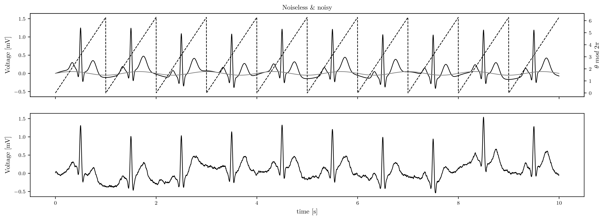

## ECG Simulator

ECG Simulator based on ECGSYN which was originally publish in [A dynamical model for generating synthetic electrocardiogram signals](https://ieeexplore.ieee.org/document/1186732). 

The simulator is agnostic to the model and includes tools to add noise & feature variability to obtain realistic ECGs. 

Assuming a model $f$ (see [ECG Models](https://github.com/sfcaracciolo/ecg_models/)), the following ODE system is solved on polar coordinates:
$$\dot{z} = \dot{f}(\theta\mod{2\pi}) - \zeta z + A_r \omega_r \cos (\omega_r t) $$
where $\dot{\theta} = \omega$ and $\dot{\rho} = \rho (1 - \rho)$.

### Usage
```python
from ecg_simulator import AbstractSimulator, repeater
from ecg_models import Human
import numpy as np 

# make a list with a beat feature for each beat. 
# In this case, a Human model from ECG Models repo.
fes = list(repeater([Human.example_beat], repeat=10))

# Build the Simulator with the derivate of the model.
class Simulator(AbstractSimulator):
    def dfdt(self, p, ω):
        return Human.dfdt(p, ω, self.fe)
    
# make an instance 
sim = Simulator(
    fs=512., # sampling frequency
    ζ=.1, # damping factor
    resp =(.15, .75) # respiration baseline (amplitud, frequency)
) 

# then, run the solver
t, θ, ρ, z = sim.solve(
    features=fes,
)

```

To add coloured noise as $(1/f)^\beta$ to the ECG, simply

```python
sim.add_noise(
    z, # ecg
    beta=2, # exponent
    snr=4, # signal-to-noise ratio
    in_place=True # adding noise in z
)
```



To add variability in the features ```random_features``` help to build the features list, e.g., 

```python
from ecg_simulator import random_features

features = random_features(
    mean_fes, # BeatFeatures with mean values
    std_fes, # BeatFeatures with std values
    N=8, # amount of beats
    seed=0 # seed of random generator
)
```

In order to build the ```BeatFeatures``` with std values, the class ```FeatureEditor``` is helpfull

```python
from ecg_simulator import FeatureEditor

editor = FeatureEditor(mean_fes) 
editor.scale(0.01, feature='μ') # scale μ feature in all waves by .01
editor.scale(0.2, feature='σ') # idem σ
editor.scale(.2, feature='a') # idem a
editor.abs(feature='a') # take absolute value
editor.model['RR'] = .05 # set the std of RR.

# std_fes = editor.model
```

To compute a RR tachogram,

```python
from ecg_simulator import tachogram, tachogram_features

rr = tachogram(
    (.1, .01, .25, .01, .5), # f1, c1, f2, c2, ratio
    (1., .05,), # RR mean, RR std
    Nb=100, # amount of beats, 
    fs=1024, # sampling frequency
    scaling=True # return scaled series according t_params
)

# then build the features ...
fes = tachogram_features(fe, rr, fs)

```

### Damping effect and convergence

If `BeatFeature` list has only one item, after `solve` method you can get the convergence limit from `sim.get_exp_lims(z, fes)` attribute


### PSD and RR tachogram

PSD parameters: $f_1=.1$, $c_1=c_2=.01$, $f_2=.25$, LF/HF ratio $.5$


RR tachgram for the above PSD with scaling for $RR$ mean $1.$ and $RR$ deviation equal to $.05$. The step plot shows the RR series that apply on the simulation.


### JavaScript example

A simplified JavaScript implementation is provided under `js/`. Open `js/index.html` in a browser to generate an example waveform using a small script that mimics the Python simulator.
