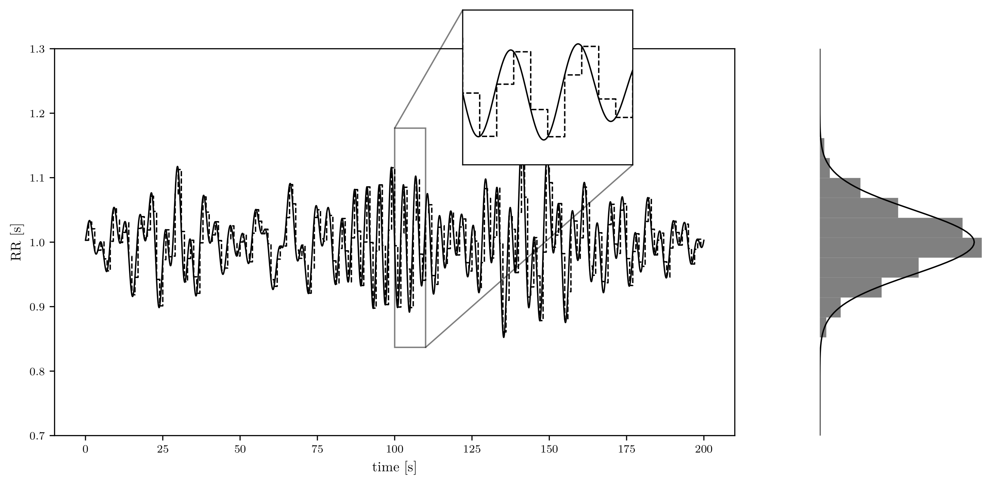

## ECG Simulator

ECG Simulator based on ECGSYN which was originally publish in [A dynamical model for generating synthetic electrocardiogram signals](https://ieeexplore.ieee.org/document/1186732). 

In this project, the implementation includes tools to add noise & feature variability to obtain realistic ECGs.

The model is a sum of Gaussian functions:
$$f = \sum_{i=0}^{M-1} g_i $$
where $g_i = a_i  \exp (-{v_i}^2/2)$ , $v_i = (\bullet -\mu_i)/\sigma_i$ and $M=5$.

The ODE system is solved on polar coordinates:
$$\dot{z} = \sum_{i\in\Gamma} \dot{g}_i(\theta\mod{2\pi}) - \zeta z + A \sin 2 \pi f t $$
where $\dot{\theta} = \omega$ and $\dot{\rho} = \rho (1 - \rho)$.

### Usage
```python
from ecg_simulator import BeatFeatures, Simulator

# create a list with the features of each beat to simulate. In this case, only one beat.
fes = [ 
    BeatFeatures(
        P=FunFeatures(a=.2, μ=np.pi*2/3., σ=.25),
        Q=FunFeatures(a=-.2, μ=np.pi*11/12., σ=.1),
        R=FunFeatures(a=1.2, μ=np.pi*1., σ=.1),
        S=FunFeatures(a=-.3, μ=np.pi*13/12., σ=.1),
        T=FunFeatures(a=.4, μ=np.pi*3/2., σ=.4),
        RR=1.
    )
]

sim = Simulator() # create the simulator

# then, run the solver
t, θ, ρ, z = sim.solve(
    fs=512., # sampling frequency
    ζ=.1, # damping factor
    features=fes, # features
    N=8 # repetead beats
)

```

To add coloured noise as $(1/f)^\beta$ to the ECG, simply

```python
sim.add_noise(
    z, # ecg
    beta=0, # exponent
    snr=10, # signal-to-noise ratio
    in_place=True # adding noise in z
)
```

To add variability in the features ```random_features``` help to build the features list, e.g., 

```python
from ecg_simulator import random_features

features = random_features(
    mean_fes, # BeatFeatures with mean values
    std_fes, # BeatFeatures with std values
    N=8, # amount of beats
    seed=0 # seed of random generator
)
```

In order to build the ```BeatFeatures``` with std values, the class ```FeatureEditor``` is helpfull

```python
from ecg_simulator import FeatureEditor

editor = FeatureEditor(mean_fes) 
editor.scale(0.01, feature='μ') # scale μ feature in all waves by .01
editor.scale(0.2, feature='σ') # idem σ
editor.scale(.2, feature='a') # idem a
editor.abs(feature='a') # take absolute value
editor.model['RR'] = .05 # set the std of RR.

# std_fes = editor.model
```

To compute a RR tachogram,

```python
from ecg_simulator import tachogram, tachogram_features

rr = tachogram(
    (.1, .01, .25, .01, .5), # f1, c1, f2, c2, ratio
    (1., .05,), # RR mean, RR std
    Nb=100, # amount of beats, 
    fs=1024, # sampling frequency
    scaling=True # return scaled series according t_params
)

# then build the features ...
fes = tachogram_features(fes[0], rr, fs)

```

#### Examples
In all cases $\zeta = .1$ and the noise has $\beta = 2$ & $SNR = 4$.

##### Case w/o variability in the features (noiseless & noisy)


##### Case with variability in the features (noiseless & noisy)


##### Damping effect and convergence

If `BeatFeature` list has only one item, after `solve` method you can get the convergence limit from `._lim` attribute


##### Case with respiration drift (noiseless & noisy)


##### Example of PSD and RR tachogram

PSD parameters: $f_1=.1$, $c_1=c_2=.01$, $f_2=.25$, LF/HF ratio $.5$


RR tachgram for the above PSD with scaling for $RR$ mean $1.$ and $RR$ deviation equal to $.05$. The step plot shows the RR series that apply on the simulation.



##### Case w/RR process (noiseless \& noisy)

PSD parameters equal to above and scaling $1.$ and $.2$ for RR parameters.

